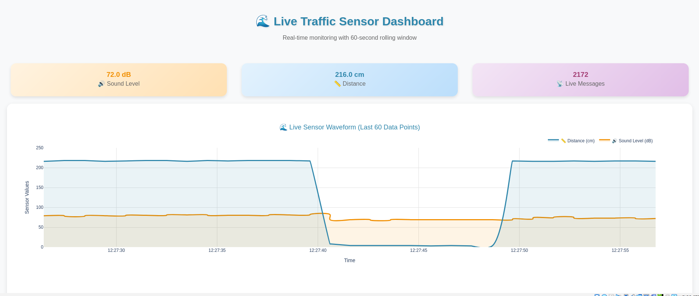
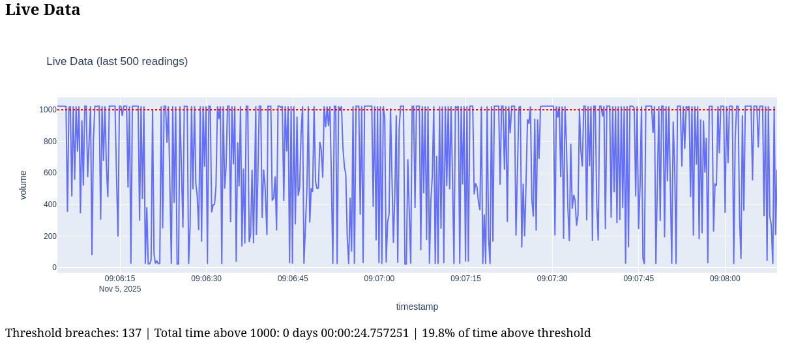

# Opgavebeskrivelse
Måling af lydniveau i vores klasseværelse over en periode på ca. en uge, for at vurdere om lydniveauet i klassen er tilpas, eller om der bør tages forholdsregler for at begrænse det.

# Løsningsforslag
Formålet med dette projekt er at tage løbende målinger på lydniveauet i vores klasseværelse. For at indsamle disse data, bygges en arduino-maskine med en lydniveau-sensor, som løbende opfanger data om lydniveauet. 
Disse data sendes til en ”server” – i dette tilfælde en Linux VM, som køres gennem VirtualBox – via Kafka, hvor den gemmes og analyseres. Analysen har bestemt en tærskel med numerisk værdi (1000). Det noteres, når denne tærskel ’brydes’ – dvs. at lydniveauet i tal overstiger den numeriske værdi – samt hvor stor en del af tiden og hvor lang tid denne tærskel er brudt over en periode. 
Der kan fra vores dashboard indhentes live- såvel som historiske data.

# Softwareoverblik
For denne case har vi gjort brug af en blanding af software og hardware. 
Hardware:

    •	Arduino
    •	PC

**Arduinoen** er valgt for sin simple opsætning og programmering. Vi har på et tidligere skoleforløbet arbejdet med Arduino, og har erfaring med dens konfiguration, både fysisk (med breadboard, ledninger, komponenter og computerens porte) samt programmatisk. 
Alternativt har vi haft adgang til Raspberry Pi, men valgte det fra, da Arduinoen vurderes fint tilstrækkelig til opgaven.
Arduinoen benytter sig af en fysisk lydsensor, som måler lydniveauet i lokalet uden at optage dets indhold. Resten opholder sig på en PC.

## Software:

    •	VirtualBox (Oracle) & Linux
    •	Kafka
    •	Python (m. diverse libraries)
    •	PostgreSQL

**VirtualBox** er valgt til konfiguration og styring af en virtuel Linux-maskine. Der uddybes på dette valg under afsnittet ”Reflektioner”, men overordnet set tilvalgte vi en Linux-VM, da flere af de programmer, vi arbejder med, er lettere at opstille og drifte i et Linux-system. Linux-systemet er Oracle Linux release 10.0. Da vi ingen præference har for systemet, har vi valgt den seneste understøttede udgivelse. 

**Kafka** er det i opgaven definerede datahåndteringssystem. Der har også været mulighed for at udforske MQTT, men grundet manglende erfaring og en deadline har vi valgt at fokusere på et enkelt system. Vores system består af en enkelt producer, som læser og sender målinger fra Arduino-maskinen til Kafka-brokeren på vores Linux-maskine.

**Python** har i denne opgave været et uvurderligt værktøj, med en bred vifte af diverse libraries, som har muliggjort vores data transfer-, processing- og analyseprocesser. Python står for at sende data fra Arduino/PC til Kafka-broker, og videre fra brokeren til database og til datavisualisering i et dashboard bygget med Plotly/Dash (libraries).

**PostgreSQL** er valgt som databasesystem, da vi gerne ville undgå en større og tungere installation à la MySQL eller SSMS. PostgreSQL kan installeres, initialiseres og administreres direkte i Linux-terminalen, og kræver reelt ingen UI eller styringsprogrammer.

# Miljøopsætning

## VM/Linux
For denne case er vores ”server” en virtuel maskine, kørt over VirtualBox.
Da vi kører på et Windows-system, er VirtualBox hentet fra Windows hosts-sektionen på deres hjemmeside.

For at kunne køre en VM, skal der hentes et image. Vi har valgt seneste udgivelse af Oracle Linux (release 10.0).

Dette image installeres på VirtualBox, og der oprettes en Linux-bruger:

`Brugernavn: sascha`

`Kodeord: Kode1234!`

## Kafka

Hent og installer Kafka via Apaches quickstart guide.

Da Java ikke er standard på dette image hentes nyeste version ved et versionstjek;
`java -version`, 
hvilket, ved prompt, lader brugeren hente og installere nyeste version.

Kafka-serveren kan nu tændes ved kommando:

`bin/kafka-server-start.sh config/server.properties`

Og der kan oprettes et topic – for os ”arduino-data”:

`bin/kafka-topics.sh --create --topic arduino-data --bootstrap-server localhost:9092`

## Visual Studio Code

Visual Studio Code er ikke strengt nødvendigt, men har gjort det lettere at udforme og iterere diverse scripts. 

Det kan hentes således:

```bash
sudo rpm --import https://packages.microsoft.com/keys/microsoft.asc
sudo sh -c 'echo -e "[code]\nname=Visual Studio Code\nbaseurl=https://packages.microsoft.com/yumrepos/vscode\nenabled=1\ngpgcheck=1\ngpgkey=https://packages.microsoft.com/keys/microsoft.asc" > /etc/yum.repos.d/vscode.repo'
sudo dnf install -y code
``` 

## PostgreSQL

PostgreSQL kan hentes tilsvarende let, men kræver lidt mere opmærksomhed i opstarten, da det er en aktivt løbende service. 

Kommenteret for overskuelighed kan du se installationsprocessen her:

```bash
sudo dnf install -y https://download.postgresql.org/pub/repos/yum/reporpms/EL-10-x86_64/pgdg-redhat-repo-latest.noarch.rpm  # add postgres repo

sudo dnf install -y postgresql16-server postgresql16-contrib  # install postgres

sudo /usr/pgsql-16/bin/postgresql-16-setup initdb  # initialise db

sudo systemctl enable postgresql-16  # enable postgresql
sudo systemctl start postgresql-16  # start PostgreSQL service
sudo systemctl status postgresql-16  # verify
```

Udover at hente og installere, starter vi også `postgresql-16`-servicen, og verificerer, at den kører. 

Herefter oprettes en database, en databasebruger, og den tabel, som kommer til at indeholde vores data.

### Database og bruger

"Log ind" på Postgres som systembruger, da ingen databasebruger endnu er oprettet, og tilgå PostgreSQL terminal:

```
sudo -i -u postgres
psql
```

I denne "terminal" kan vi oprette den ønskede database og bruger, samt tildele de nødvendige læse/skrive-rettigheder:

```sql
postgres=# CREATE DATABASE arduino_data;
CREATE DATABASE
postgres=# CREATE USER sascha WITH ENCRYPTED PASSWORD 'Kode1234!';
CREATE ROLE
postgres=# GRANT ALL PRIVILEGES ON DATABASE arduino_data TO sascha;
GRANT
postgres=# \q
```

I dette tilfælde opretter jeg en bruger, som matcher min Linux-brugers brugernavn, da det muliggør tilslutning til databasen uden et password-login. Dette kan ses som en usikkerhed, men da projektets fokus er læring, dataoverførsel og analyse, har vi for lethedens skyld valgt en kodefri tilslutning.

Der er nu oprettet en databasebruger med credentials:

`Brugernavn: sascha`

`Kodeord: Kode1234!`

### Tabel

Med database og databasebruger oprettet, forlader vi superbrugeren ved kommandoer:

 ```sql
 \q 
 exit
 ```

og logger i stedet ind på den nye databasebruger, sascha:

```bash
psql -U sascha -d arduino_data
```

Det er vigtigt, at selve tabellen oprettes under den korrekte bruger. Uddybning under 'Reflektioner'. 

Med `psql` "terminalen" åben, kan vi igen skrive SQL:


```sql
postgres=# CREATE TABLE arduino_readings (
postgres(# id SERIAL PRIMARY KEY,
postgres(# timestamp TIMESTAMP DEFAULT CURRENT_TIMESTAMP,
postgres(# volume INT
postgres(# );
```

Her oprettes en meget simpel tabel, som blot indeholder den målte numeriske værdi fra Arduinoen, samt det timestamp, det er inserted på.

Vi ender altså med at have en tabel til opsamlet Arduino-data:

`Tabelnavn: arduino_readings`

### Netværk

Her er første punkt, hvor Tians og mit projekt afviger en smule. 

Jeg har valgt at sende data fra min PC til min VM over netværket, hvor Tian har valgt at køre det hele i sin VM. 
Vi har talt om pros and cons, og er kommet frem til, at det i projektregi ikke ville gøre en forskel. Forskellen er drevet af interesse, da den COM-port, Arduinoen sender til, sagtens kan læses fra VM, eller alternativt sagtens kan sendes over netværket via en Kafka-producer.

#### All in VM

For at få adgang fra Linux VM til den COM-port, Arduinoen skriver til, skal USB slås til i VirtualBox.

Vælg din VM i VirtualBox, og gå til:

`Settings -> USB -> Enable USB Controller -> Tilføj`

Her er det muligt at vælge den USB-port, Arduinoen skriver til. Dette gør, at data kan læses direkte fra din VM, selvom den måles og sendes til en port i din fysiske maskine.

#### Data over netværk

For at kunne sende data fra din PC, hvor målingerne tages, til Kafka-brokeren i den virtuelle maskine, skal der ændres på netværksindstillingerne:

`Settings -> Network -> NAT`

Her kan 'NAT' ændres i en dropdownmenu til 'Bridged Adapter'. Med denne ændring kan den virtuelle maskine findes på samme netværk, som din PC. 

Yderemere er der et par ekstra steps;

En property, `advertised.listeners` under `config/server.properties` opdateres til at inkludere den nye IP-adresse, som nu tilhører den virtuelle maskine. 

Denne IP-adresse kan findes ved kommando: `ifconfig`.

`advertised.listeners` opdateres således:

`advertised.listeners=PLAINTEXT://<VM_IP>:9092,CONTROLLER://<VM_IP>:9093`

hvor `<VM_IP>` i mit tilfælde er `10.101.129.170`.

Til sidst undtages porten i den virtuelle maskines firewall, og vi sikrer at den er åben:

```
sudo firewall-cmd --add-port=9092/tcp --permanent  # open port
sudo firewall-cmd --reload  # reload to ensure port is added
sudo firewall-cmd --list-ports  # list to verify
```

Herfra køres alt over producer/consumer scripts, som kan ses/hentes fra vores [Github](WWW.INDSÆT.LINK).

## Producer

For at kunne sende data fra Arduinoen, skal de sendes via producer. Scripts kan findes på vores [Github](WWW.INDSÆT.LINK).

## Consumers

Samme gør sig gældende for de consumers, som findes på vores VM.

Disse findes i Python scripts, og eksekveres ved hhv:

```bash
python database_consumer.py
python dashboard_consumer.py
```

# Dashboards

For at kunne analysere, visualisere og bruge vores indsamlede data, har hver af os bygget et dashboard. 

Tians er mere avanceret, da hun har valgt at inkludere en ekstra dimension i distance.



Mit eget dashboard fokuserer mere på brud på det valgte threshold (1000).



Begge dashboards giver dog et overblik, samt brugbare data, som kan hjælpe os med at danne en konklusion.

# GDPR
Arduinoens sensor opfanger udelukkende lydniveau, og intet af lydens indhold. Dvs., at de eneste data, som reelt behandles, er tal. Data håndteres af Kafka, og føres til to ”endpoints”; en PostgreSQL database, og et datavisualiserings-dashboard.
Der gøres i dette setup ikke brug af brugere, udover hvad der er specificeret foroven. Disse brugere er til systemet og til databaseadministration, og indeholder ingen personhenførbar information. 
Grundet dataenes natur og type er der ikke implementeret nogle GDPR-foranstaltninger.


# Analyse 
Vores arduino måler lydniveauet i klasseværelset. Lydsensoren er nøje justeret til at kunne opfange alt fra stilhed til de højeste spikes.
Sensoren sender 4 målinger pr. sekund, for at give et billede på hurtige skift i lydniveau.
Analyse af de målte data viser, at både sensorens højeste og laveste niveauer figurerer prominent i dens målinger, men at lydniveauet generelt ligger højt – også så højt, at sensoren ofte møder sit loft. Havde sensoren været justeret til at opfange højere lyde mere granulært, ville meget gå tabt i de lavere niveauer. 
Den umiddelbare konklusion ud fra sensorens målinger er altså, at lydniveauet generelt ligger meget højt i det målte lokale.

# Anbefalinger 

Til casen:
Med de målte data kan vi vurdere, at der generelt findes et højt lydniveau i målte lokale. Anbefalinger kunne være: 
•	Støjdæmpende paneler på vægge og om skriveborde
•	Gulvtæppe
•	Færre elever pr. lokale
•	Større fokus på at holde et acceptabelt lydniveau, som forventes i et professionelt miljø

# Reflektioner (ting, jeg har lært under projektet)

Da vi begge har Windows-maskiner udleveret fra vores respektive arbejdspladser, forsøgte vi først at få Kafka til at køre over Windows. Det viste sig dog at være mere besværligt end vi havde regnet med. Da flere ting i løbet af vores Big Data-forløb har været rettet mod Linux, var vurderingen, at det var lettere, at installere et Linux-image på en VM, og køre dem der. F.eks. pyspark, Kafka. 

Jeg oplevede en del problemer i første omgang med at få indsat vores målinger i en PostgreSQL-database. Dette skyldes formentlig, at jeg fik oprettet tabellen på den indbyggede `postgres` systembruger, i stedet for på den bruger jeg oprettede til formålet. Uanset hvilke rettigheder, ownerships af tabel, database og skema, jeg fik tildelt til "min" bruger, fik den aldrig læse/skriverettighed. 

Jeg skriver 'formentlig', da jeg ikke endte med en reel løsning; jeg fjernede alt fra maskinen, som havde noget med Postgres at gøre, og startede forfra. Dette gjorde jeg grundet time constraints, da det ikke var produktivt at bruge tid på databasen, fordi der stadig var opgaver ifm. casen, der skulle løses.

Udover de små hik, har alt generelt kørt godt på den virtuelle Linux-maskine. Modsat Windows er et Linux-system fint konfigurerbart, og indenfor opgavens scope mødte vi ingen problemer med kompatibilitet.


# Scripts

Pip installs:
`pandas, plotly, dash, psycopg2-binary, kafka, serial`
