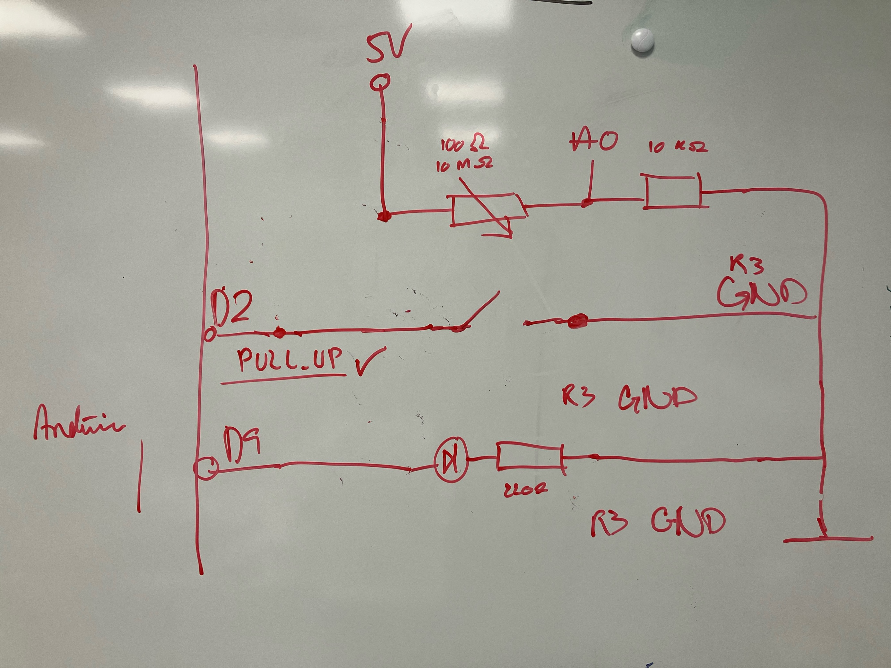

# Konstruktion

Der er bygget en maskine, som optager et lys-input analogt. Inputtet oversættes og sendes ud til en LED via en digital kanal. 

Formålet med konstruktionen er at få en LED til at lyse omvendt proportionelt med lysniveauet; dvs. at jo mere lys LDR'en fanger, desto mindre lyser LED'en. Er der lyst, lyser LED'en slet ikke. Er der mørkt, lyser den, fra mindst værdi ved højeste mørkeværdi, til maksimalt lys ved laveste mørkeværdi. 

Arduino UNO R3 er tilsluttet PC, og udformer sig efter følgende diagram:

Breadboardet har flere "tilslutningspunkter" til Arduinoen. Den er forbundet via:

* 5V
* A0
* D2
* D9
* GND

Samlet set ligger kredsløbet i, at alt går fra udgange på Arduino-siden til jord (GND), også på Arduinosiden.

## Delelementer

Konstruktionen består af 3 mindre elementer;

* LDR
* Switch
* LED

### LDR

Dette delelement består af en LDR (100Ω-10MΩ), som måler lysinput, og sender et analogt signal til Arduinoens A0-kanal. Gennem en fast resistor (10KΩ) forbindes LDR til jord.

### Switch

Switchen forbindes via Arduinoens D2-kanal, og tænder/slukker for programmes loop (kørsel). På den anden side er switchen igen tilsluttet jord. 

Der findes på brættet ingen modstand for switchen. I stedet benyttes "pull-up" resistance i selve Arduino-kortet. 

### LED

LED'en er forbundet via Arduinoens D9-kanal. Her sendes et digitalt signal, som er omvendt proportionelt med det målte fra LDR'ens analogkanal. Mellem LED og jord er en 220Ω resistor. 